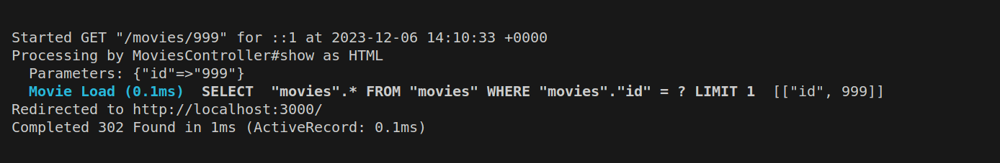
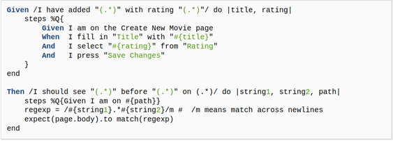

# Practica Calificada 5
### Alumna: Zuñiga Chicaña Alejandra

# Pregunta 1
1. En las actividades relacionados a la Introducción de Rails los métodos actuales del controlador no son muy robustos: si el usuario introduce de manera manual un URI para ver (Show) una película que no existe (por ejemplo /movies/99999), verás un mensaje de excepción horrible. Modifica el método show del controlador para que, si se pide una película que no existe, el usuario sea redirigido a la vista Index con un mensaje más amigable explicando que no existe .

Como se menciono, al introducir un URI para ver una pelicula que no existe se verá un mensaje de error.

 


Modificaremos el  método show del controlador para que se muestre el mensaje de error si el usuario no existe.


Como se puede observar ahora ya no nos aparece ese mensaje de error, sino nos redirige a la página principal, vemos el terminal para obtener mejor informacion:




Si queremos que se nos muestre un mensaje que la pelicula no fue encontrada, se tendrá que modificar también el archivo index.


Por el momento se tiene asi el mensaje, se espera mejorar para que sea una ventana emergente y aparezca tan solo 1 vez.


2.	En las actividades relacionados a Rails Avanzado, si tenemos el siguiente ejemplo de código que muestra cómo se integra OmniAuth en una aplicación Rails:

```ruby
class SessionsController < ApplicationController
 	   def create
    	         @user = User.find_or_create_from_auth_hash(auth_hash)
    	         self.current_user = @user
    	         redirect_to '/'
                   end
          	  protected
          	  def auth_hash
            		request.env['omniauth.auth']
                 end
              end

```
El método auth_hash  tiene la sencilla tarea de devolver lo que devuelva OmniAuth como 
resultado de intentar autenticar a un usuario.

 ¿Por qué piensa que se colocó esta funcionalidad en su propio método en vez de simplemente referenciar request.env[’omniauth.auth’] directamente? 

Se colocó esta funcionalidad en vez de referenciar request.env[’omniauth.auth’] directamente debido a lo siguiente:

    1. Reusabilidad:
    - Al tener la lógica encapsulada en su propio método, se facilita la reutilización de esa funcionalidad en otros lugares del código si es necesario, ya que luego si se desea acceder al hash de autenticación en otro controlador o acción, simplemente se puede llamar al método `auth_hash`.

    2. Facilita Pruebas (Testing):
    - Colocar la lógica en un método separado facilita la escritura de pruebas (tests). Puede probar fácilmente el método `auth_hash` de forma aislada para asegurarse de que está extrayendo correctamente la información de autenticación sin tener que lidiar con el entorno completo de `request.env['omniauth.auth']`.

    3. Adaptabilidad a Cambios Futuros:
    - Si en el futuro cambian los detalles de cómo OmniAuth maneja la autenticación o si se elige utilizar una estrategia diferente, tener la lógica encapsulada en un método permite realizar modificaciones con menor impacto en el resto del código.

    4. Principio de Responsabilidad Única:
    - Este enfoque sigue el principio de responsabilidad única, que aboga por que cada método o clase tenga una única responsabilidad. El método `auth_hash` se encarga específicamente de extraer el hash de autenticación, lo que facilita la comprensión y el mantenimiento del código.

3. En las actividades relacionados a JavaScript, Siguiendo la estrategia del ejemplo de jQuery utiliza JavaScript para implementar un conjunto de casillas de verificación (checkboxes) para la página que muestra la lista de películas, una por cada calificación (G, PG, etcétera), que permitan que las películas correspondientes permanezcan en la lista cuando están marcadas. Cuando se carga la página por primera vez, deben estar marcadas todas; desmarcar alguna de ellas debe esconder las películas con la clasificación a la que haga referencia la casilla desactivada.

Se utilizo el repositorio 'rottenpotatoes-rails-intro' para la ejecución de este ejemplo, dicho repositorio se hizo uso en la PC3 del curso, a continuación se detallara los cambios realizados en los archivos correspondientes para así logar lo que se nos pide:

Como se aprecia aqui, se esta haciendo uso del repositorio mencionado


A continuación ejecutamos el comando 'rails server' para asi poder poder ver el servidor en el puerto 3000


Como se observa, las casillas estan marcados apenas se carga la pagina, ahora veremos que al desmarcar una de ellas filtraremos las películas con la clasificación a la que haga referencia la casilla desactivada. 

 

Para lograr lo dicho, se realizaron los siguientes cambios:

Hemos añadido un método de clase `with_ratings` en el modelo `Movie` que filtra las películas según las clasificaciones proporcionadas.

```ruby
class Movie < ActiveRecord::Base
  def self.with_ratings(ratings_list)
    return all if ratings_list.blank?

    where(rating: ratings_list)
  end
end
```

Este método utiliza el método `where` de ActiveRecord para filtrar las películas basándose en las clasificaciones proporcionadas.Así como se observa a continuación:


Pero vemos que aun no nos muestra las peliculas por su clasificacion, es por esto que se modificó el controlador asociado para incorporar este nuevo método de clase en el modelo. En el controlador, se accede a las clasificaciones seleccionadas a través de la variable @ratings_to_show, que se obtiene de los parámetros de la URL.


Aquí, @all_ratings se utiliza para proporcionar una lista de todas las clasificaciones posibles a la interfaz de usuario. Las clasificaciones seleccionadas se obtienen de @ratings_to_show, y luego se utiliza el método with_ratings del modelo Movie para obtener las películas filtradas según esas clasificaciones.

Ahora si vemos que si se filtran las peliculas segun sus calificaciones:


4. De la actividad relacionada a BDD e historias de usuario crea definiciones de pasos que te permitan escribir los siguientes pasos en un escenario de RottenPotatoes:

```ruby
Given the movie "Inception" exists
	And it has 5 reviews
	And its average review score is 3.5
```

6. De la actividad relacionadas a BDD e historias de usuario indica una lista de pasos como los de la siguiente figura. 



Para implementar el paso `When I delete the movie: "(.*)"`, como se nos pide podemos utilizar un enfoque a los pasos existentes en tu archivo de especificaciones. 

```ruby
When /I delete the movie: "(.*)"/ do |title|
  movie = Movie.find_by(title: title)

  steps %Q{
    Given I am on the Movies page
    When I follow "#{title}"
    And I press "Delete Movie"
  }
end
```

Esta implementación asume que tienes un modelo `Movie` y que tienes una ruta o un enlace en la página de películas que permite borrar la película. 


7. Basándose en el siguiente fichero de especificaciones (specfile), ¿a qué métodos deberían responder las instancias de F1 para pasar las pruebas?


Según las especificaciones proporcionadas en el código RSpec, se espera que las instancias de la clase `F1` respondan a los siguientes métodos para pasar las pruebas:

1. **`be_a_pain_in_the_butt`**
   - Se espera que las instancias de `F1` respondan al método `be_a_pain_in_the_butt`.

2. **`be_awesome`**
   - Se espera que las instancias de `F1` respondan al método `be_awesome`.

3. **`be_nil`**
   - Se espera que las instancias de `F1` respondan al método `be_nil`.

4. **`==`**
   - Se espera que las instancias de `F1` respondan al método `==` para verificar que no son iguales a una cadena vacía.

Por lo tanto, para que las instancias de `F1` pasen todas las pruebas, la clase `F1` debe implementar o tener definidos los métodos mencionados anteriormente (`be_a_pain_in_the_butt`, `be_awesome`, `be_nil`, `==`). Dependiendo de cómo estén implementados estos métodos en la clase `F1`, la prueba se ejecutará correctamente o fallará.

# Pregunta 2

Se utilizará el repositorio proporcionado en el archivo zip de esta evaluación, para ellos pondremos en funcionamiento RottenPotatoes. Este es el mismo conjunto de pasos que damos en la mayoría de las aplicaciones Rails nuevas.

    cd rottenpotatoes
    bundle install --without production 
    bin/rake db:setup 
    bin/rails server -b 0.0.0.0


Verificamos que puedas cargar RottenPotatoes y que tengamos algunas películas en la base de datos.


Antes de continuar verificamos que nuestra aplicación esté configurada correctamente y sin errores:

```
bundle exec cucumber
```
Lee el resultado. ¿Tiene sentido? (Se esperan pruebas fallidas porque aún no las ha implementado).

 


Al ejecutar el comando anterior en el terminal obtenemos las imagenes proporcionadas, nos muestran los escenarios proporcionados, como se observa aún no se ha implementado ninguna prueba.


Ahora se implementó la primera prueba, para ello se borrro el pending una vez implementado. 


Como se observa, se pudo completar el escenario de esta prueba y las demás aún no.


 